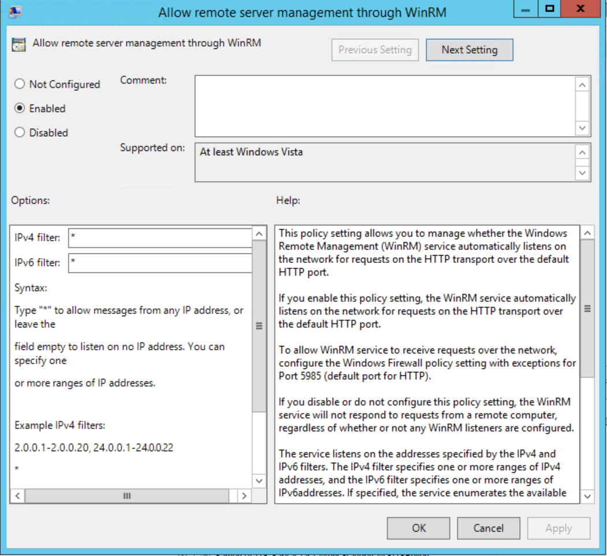
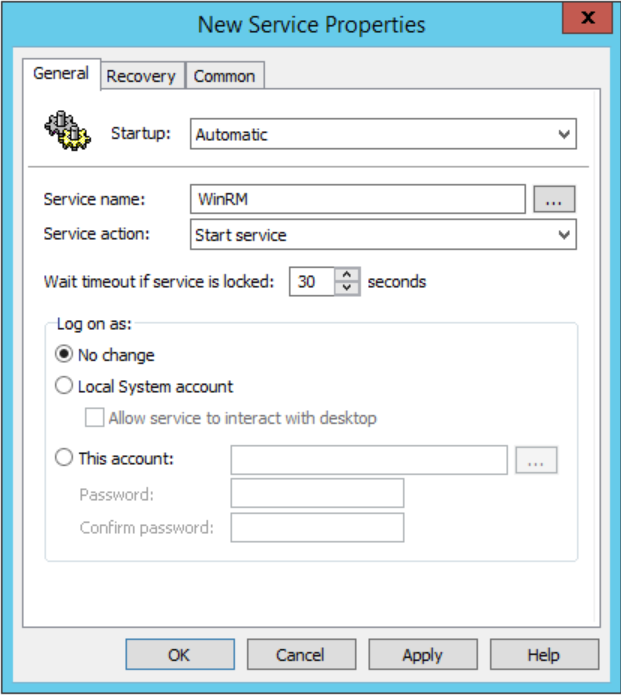
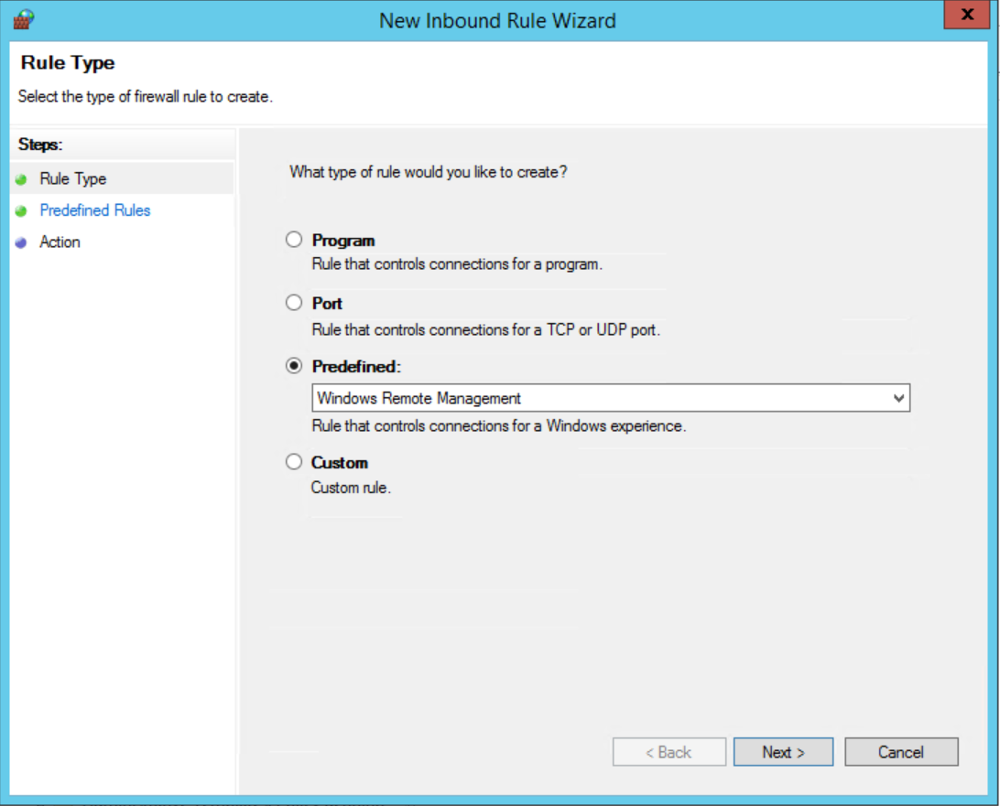
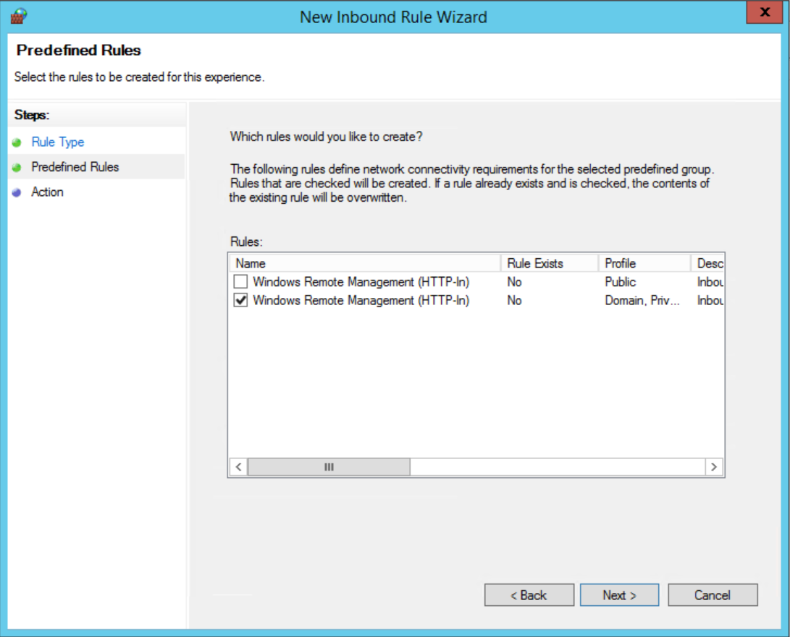

# WinRM Configuration in Enterprise AD

Microsoft Windows Server based OS enabled WinRM by default, howver, it is disabled by default on Desktop based Windows System. In large Scale Enterprise AD, enable it is useful to run management tasks remotely. This guide assume Windows AD is deployed.

## Enable Allow remote server management through WinRM 

GPO -> Computer Configuration -> Administrative Templates -> Windows Components -> Windows Remote Management(WinRM) -> WinRM Service -> Allow remote server management through WinRM

## Enable and startup WinRM Service

GPO -> Computer Configuration -> Preferences -> Control Panel Settings -> Services

Add new server for WinRM.

    Startup to Automatic
    Service name to WinRM.
    Service action -> Start Service

## Opening firwall for WinRM service

1. Select Windows Remote Management from Predefined rule type dropdown list.

2. Check Windows Remote Management (HTTP-In) from Predefined Rules. 
Click next until finish this step.

3. Link this GPO to target OU.

## Functional Verify and Troubleshooting

1. On remote management server, establish a new PSSession, the expected output like that:

    PS C:\Users\EDFHILB> New-PSSession shaojc-hp

    Id Name            ComputerName    State         ConfigurationName     Availability
    -- ----            ------------    -----         -----------------     ------------
    11 Session11       shaojc-hp       Opened        Microsoft.PowerShell     Available

2. On WinRM Client computer, port 5985 is in LISTENING state.

        PS C:\Windows\system32> netstat -anp tcp

        Active Connections

        Proto  Local Address          Foreign Address        State
        TCP    0.0.0.0:135            0.0.0.0:0              LISTENING
        TCP    0.0.0.0:445            0.0.0.0:0              LISTENING
        TCP    0.0.0.0:2179           0.0.0.0:0              LISTENING
        TCP    0.0.0.0:3389           0.0.0.0:0              LISTENING
        TCP    0.0.0.0:5040           0.0.0.0:0              LISTENING
        TCP    0.0.0.0:5357           0.0.0.0:0              LISTENING
        TCP    0.0.0.0:5985           0.0.0.0:0              LISTENING
        TCP    0.0.0.0:7680           0.0.0.0:0              LISTENING

