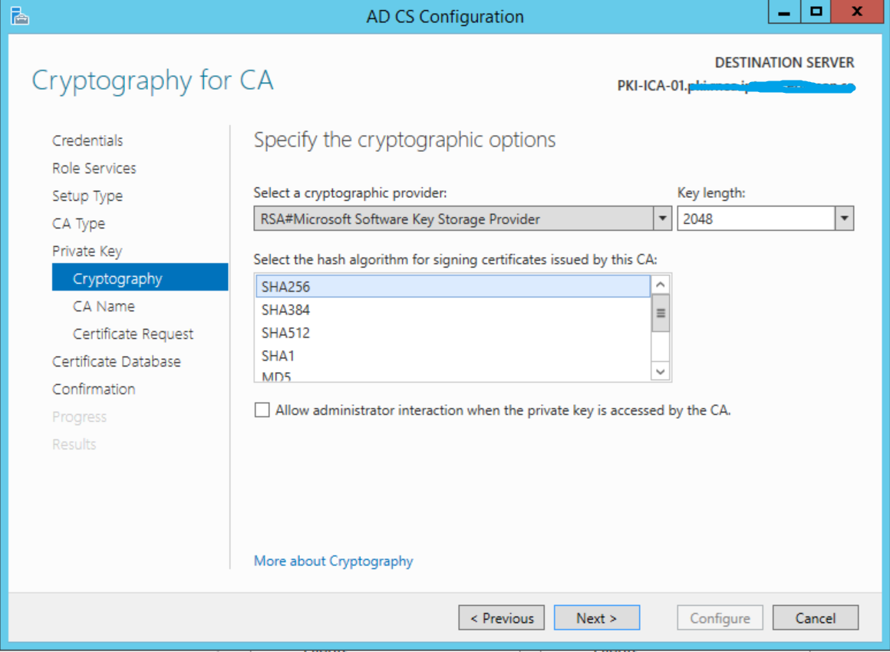
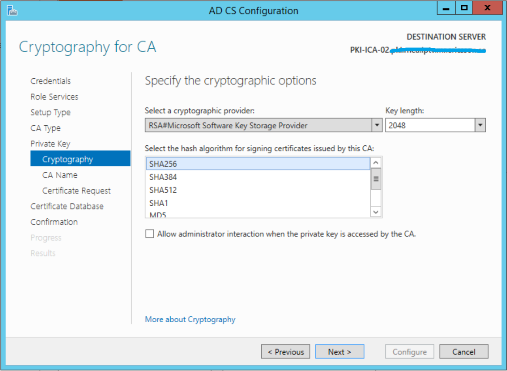
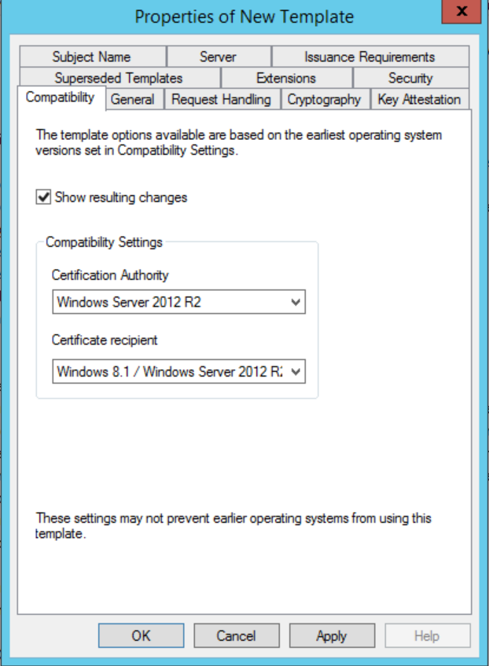

# Three tires Windows CA Setup with fully SHA256 signed certificates.

## Major change based on MR3.0 PKI document.

* Switch to SHA256 algorithm on each level of CA.
In CA setup wizard, change the algorithm from ``SHA1`` to ``SHA256``.

* Compatibility settings change of MR Server Certificate Template.

## CAPolicy and postinstall commandline

* ROOTCA

    >CAPolicy_root.inf  
    >rootCA_postinstall1.cmd  
    >rootCA_postinstall2.cmd

* IntermediateCA

    >CAPolicy_intermediate.inf  
    >intermediateCA_postinstall1.cmd

* IssuingCA

    >CAPolicy_IssuingCA.inf  
    >issuingCA_postinstall.cmd  

## Generate serverauth.xml

Run this commandline to get serverauth.xml to get VO on rootca level.

## Update custom.xml

There is a ``custom.xml`` for ALL-IN-ONE DR servers.