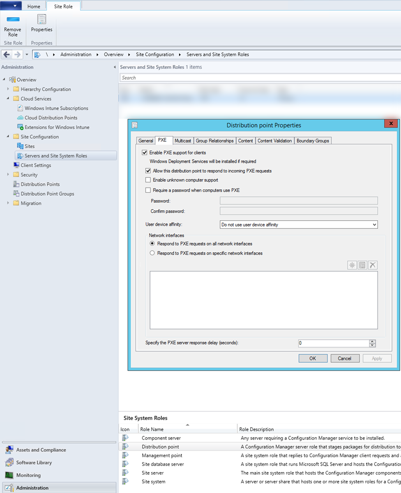
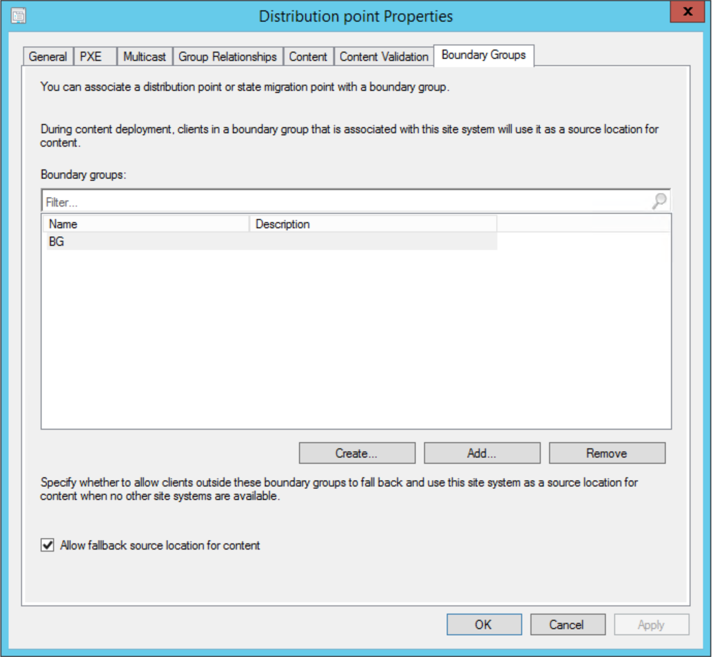
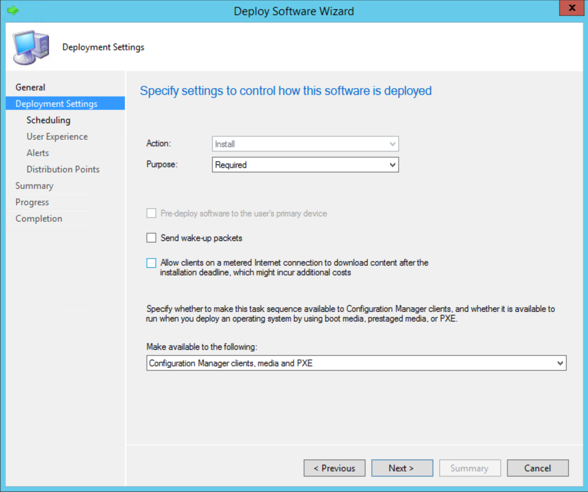
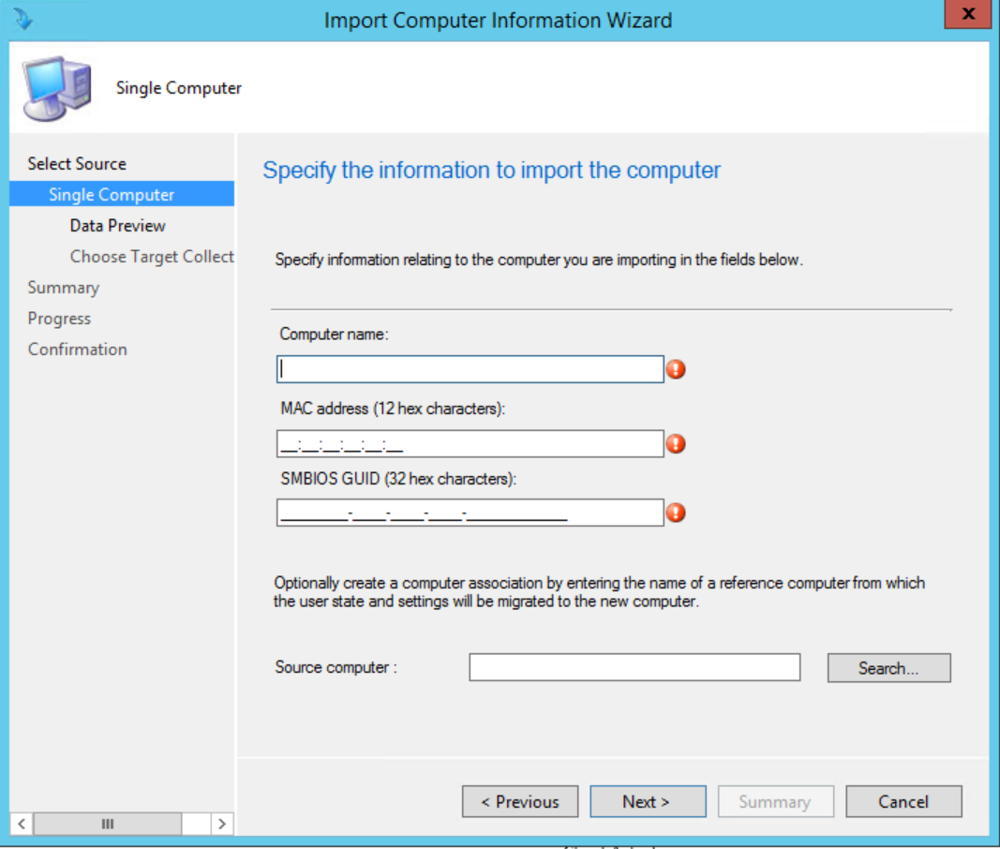
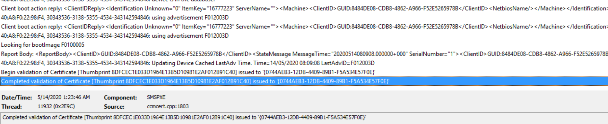

# Zero Touch Installation on SCCM

This guide give you a brief introduction of Windows ZTI on SCCM. I assume the following prerequistie is satisfied:

* SCCM2012R2 deployed and in function.

* ip helper configured on switch side.

* Windows OS installation media and Hardware drivers, expecially of Network Adapter and Raid Card.

# Configuration on SCCM site:

1. Enable PXE support for DP, and add it to appropriate boundry group.

Administration -> Site Configuration -> Servers and Site System Roles -> Select Site Server in middle window.

In Site System Roles panel, double click Distribution point

In PXE tab, chck 
> * Enable PXE support for clients
> * Allow this distribution point to response to incoming PXE requests
> * Enable unknown computer support.



In Boundary Groups tab, 
Add this DP to appropriate boundry group.




2. Add OS installation Package

> Software Libray -> Operating System Images -> Add Operating System Image.


3. Add Driver Package, e.g. HP SPP for Proiant Server.
Since WindowsServer 2012R2 installation media has already integrated all drivers of DL380Gen8, so you don't need add any additional drivers to boot image.


content of Install_HPSPP.bat

```bat

:Init
  @Echo Off
  Cls
  
:Main
  Echo HP Proliant Support Pack
  Echo Source : %~dp0
  Echo ===============================================================================
  Echo Installing the HP Proliant Support Pack
  Echo Command: "%~dp0hpsum" /s /use_latest
  "%~dp0hpsum" /s /use_latest
  
:CheckForErrors
  Echo HP SPP
  
  If "%errorlevel%"=="0" (
     Echo Installation Successful!
     exit 0
  )
  
  If "%errorlevel%"=="1" (
     Echo Installation Successful, but a reboot is required.
     exit 0
  )
  
  If "%errorlevel%"=="3" (
     Echo Installation was canceled, or no components were updated
     exit 0
  )
  
  
:End
  exit %errorlevel%  
```


4. Create task sequence

Software Library -> Operating Systems -> Task Sequences


5. Deploy TS to target Device Collections

Change purpose to Require for less human interact, and make it available for CM clients, media and PXE.



6. Import target computer to SCCM Device collection.

Assets and Compliance -> Devices

Navigate to device collection which OS task sequence deployed to.

Import Computer Information -> Import single computer



7. Boot from PXE on target machine.


# Troubleshooting tips

PXE part:
[SCCM]\Logs\smspxe.log

